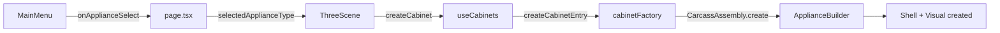
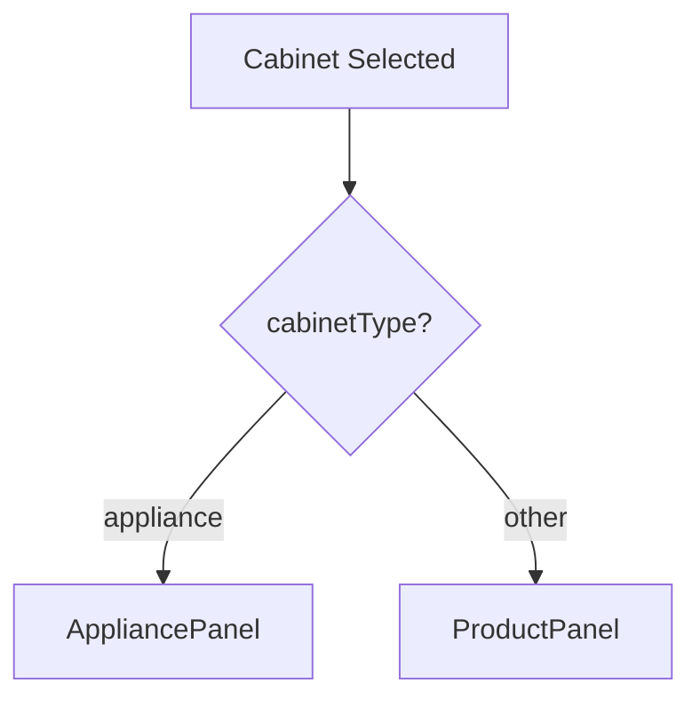
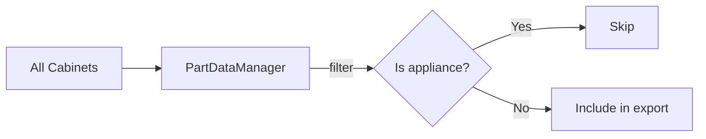

# Appliance Cabinet Type - AI Coding Guide

This guide explains how the **appliance** cabinet type works, its similarities and differences with regular cabinets, and how it's managed throughout the codebase.

---

## Overview

Appliances are a special cabinet type representing physical appliances (dishwashers, washing machines, fridges) in the 3D scene. They serve as **placeholders** to help users visualize appliance placement and ensure proper spacing.

**Key characteristics:**

- Not manufactured parts (excluded from nesting/exports)
- No ERP product data (no `wsProduct`, no pricing)
- Uses `AppliancePanel` instead of `ProductPanel`
- Two-layer visual architecture (shell + inner visual)

---

## Architecture: Two-Layer Design

Unlike regular cabinets with multiple carcass parts (sides, back, base, shelves), appliances use a simplified two-layer architecture:

```
┌─────────────────────────────────────┐
│  ApplianceShell (blue wireframe)    │  ← Functional boundaries
│  ┌─────────────────────────────┐    │
│  │                             │    │
│  │   ApplianceVisual (solid)   │ ↑  │  ← Decorative inner box
│  │                             │ gap│
│  └─────────────────────────────┘    │
└─────────────────────────────────────┘
```

### ApplianceShell

- **Purpose**: Defines functional boundaries for snapping, dimensions, and view grouping
- **Visual**: Blue wireframe only (no fill)
- **File**: [ApplianceShell.ts](file:///c:/Programming/cabinets-3d-next/src/features/carcass/parts/ApplianceShell.ts)

### ApplianceVisual

- **Purpose**: Decorative representation of the appliance
- **Visual**: Solid colored box (color varies by appliance type)
- **Positioning**: Inside the shell with configurable gaps (top, left, right)
- **File**: [ApplianceVisual.ts](file:///c:/Programming/cabinets-3d-next/src/features/carcass/parts/ApplianceVisual.ts)

---

## Similarities with Regular Cabinets

| Feature                      | Regular Cabinet | Appliance | Notes                                 |
| ---------------------------- | --------------- | --------- | ------------------------------------- |
| Uses `CarcassAssembly`       | ✅              | ✅        | Both are instances of CarcassAssembly |
| Stored as `CabinetData`      | ✅              | ✅        | Same data structure in scene          |
| Selection/highlighting       | ✅              | ✅        | Same selection mechanism              |
| Drag movement                | ✅              | ✅        | Same movement/snapping logic          |
| View assignment              | ✅              | ✅        | Can be assigned to views              |
| Created via `cabinetFactory` | ✅              | ✅        | Same factory pattern                  |
| Has `cabinetType`            | ✅              | ✅        | Part of `CabinetType` union           |

---

## Differences from Regular Cabinets

| Feature            | Regular Cabinet        | Appliance                       |
| ------------------ | ---------------------- | ------------------------------- |
| Panel component    | `ProductPanel`         | `AppliancePanel`                |
| Product ID         | ERP `productId`        | Synthetic: `"appliance-{type}"` |
| ERP data           | Fetches `wsProduct`    | None                            |
| Price calculation  | Yes                    | No                              |
| Material selection | Yes                    | No                              |
| Nesting export     | Included               | **Filtered out**                |
| Part dimensions    | Multiple parts         | Empty array                     |
| Builder            | Type-specific builders | `ApplianceBuilder`              |

---

## Key Files

### Core Implementation

| File                                                                                                             | Purpose                                     |
| ---------------------------------------------------------------------------------------------------------------- | ------------------------------------------- |
| [ApplianceBuilder.ts](file:///c:/Programming/cabinets-3d-next/src/features/carcass/builders/ApplianceBuilder.ts) | Creates shell + visual, returns empty parts |
| [ApplianceShell.ts](file:///c:/Programming/cabinets-3d-next/src/features/carcass/parts/ApplianceShell.ts)        | Wireframe boundary box                      |
| [ApplianceVisual.ts](file:///c:/Programming/cabinets-3d-next/src/features/carcass/parts/ApplianceVisual.ts)      | Solid inner visual with gap offsets         |

### UI Components

| File                                                                                                      | Purpose                     |
| --------------------------------------------------------------------------------------------------------- | --------------------------- |
| [AppliancePanel.tsx](file:///c:/Programming/cabinets-3d-next/src/features/cabinets/ui/AppliancePanel.tsx) | Edit dimensions and gaps    |
| [MainMenu.tsx](file:///c:/Programming/cabinets-3d-next/src/components/MainMenu.tsx)                       | Appliance selection buttons |

### Integration Points

| File                                                                                                         | Purpose                        |
| ------------------------------------------------------------------------------------------------------------ | ------------------------------ |
| [cabinetFactory.ts](file:///c:/Programming/cabinets-3d-next/src/features/cabinets/factory/cabinetFactory.ts) | Default dimensions & config    |
| [ThreeScene.tsx](file:///c:/Programming/cabinets-3d-next/src/features/scene/ThreeScene.tsx)                  | Creation effect, panel routing |
| [PartDataManager.ts](file:///c:/Programming/cabinets-3d-next/src/nesting/PartDataManager.ts)                 | Filtering from exports         |
| [CarcassAssembly.ts](file:///c:/Programming/cabinets-3d-next/src/features/carcass/CarcassAssembly.ts)        | Stores appliance config        |

---

## Data Flow

### Creation Flow



### Panel Routing



### Export Filtering



---

## Configuration

### CarcassConfig Fields

```typescript
interface CarcassConfig {
  // ... other fields
  applianceType?: "dishwasher" | "washingMachine" | "sideBySideFridge"
  applianceTopGap?: number // Gap between visual top and shell top (mm)
  applianceLeftGap?: number // Gap on left side (mm)
  applianceRightGap?: number // Gap on right side (mm)
}
```

### Default Dimensions

```typescript
appliance: { width: 600, height: 820, depth: 600 }
```

### Appliance Types & Colors

| Type               | Color      | Hex       |
| ------------------ | ---------- | --------- |
| `dishwasher`       | Slate Gray | `#708090` |
| `washingMachine`   | Light Gray | `#E8E8E8` |
| `sideBySideFridge` | Silver     | `#C0C0C0` |

---

## AppliancePanel Features

The `AppliancePanel` is a simplified version of `ProductPanel`:

| Feature                      | Included |
| ---------------------------- | -------- |
| Dimension sliders (W/H/D)    | ✅       |
| Gap sliders (top/left/right) | ✅       |
| View assignment              | ✅       |
| Material selection           | ❌       |
| Price display                | ❌       |
| ERP data fetching            | ❌       |

**Important**: AppliancePanel uses `.productPanel` class and `data-product-panel` attribute to prevent click-through to the 3D canvas (same pattern as ProductPanel).

---

## Adding New Appliance Types

To add a new appliance type (e.g., `oven`):

1. **Update types** in [CarcassAssembly.ts](file:///c:/Programming/cabinets-3d-next/src/features/carcass/CarcassAssembly.ts):

   ```typescript
   applianceType?: "dishwasher" | "washingMachine" | "sideBySideFridge" | "oven"
   ```

2. **Add color** in [ApplianceVisual.ts](file:///c:/Programming/cabinets-3d-next/src/features/carcass/parts/ApplianceVisual.ts):

   ```typescript
   const APPLIANCE_COLORS = {
     // ...
     oven: 0x2f2f2f, // Dark gray
   }
   ```

3. **Add menu button** in [MainMenu.tsx](file:///c:/Programming/cabinets-3d-next/src/components/MainMenu.tsx)

4. **Update factory types** in [cabinetFactory.ts](file:///c:/Programming/cabinets-3d-next/src/features/cabinets/factory/cabinetFactory.ts)

5. **Update AppliancePanel info** in [AppliancePanel.tsx](file:///c:/Programming/cabinets-3d-next/src/features/cabinets/ui/AppliancePanel.tsx):
   ```typescript
   const APPLIANCE_INFO = {
     // ...
     oven: { label: "Oven", icon: "🔥" },
   }
   ```
